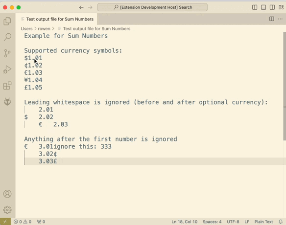

# Sum Numbers

Compute the sum of the numbers found at the beginning of each selected line, ignoring currency symbols.

## Demo

## Instructions

Select the lines you want to sum.

Select "Sum Numbers" in the program bar (which can typically be opened with command-shift-P on macOS and ctrl-shift-P on linux and windows).

Note that Sum Numbers processes full lines, starting with the first line containing the selection and ending with the last line containing the selection.

## Source

https://github.com/r-owen/vscode_sum_numbers

To build from source and install, execute the following in the root directory of this package:

npx @vscode/vsce package
code --install-extension sumnumbers  # use tab completion
